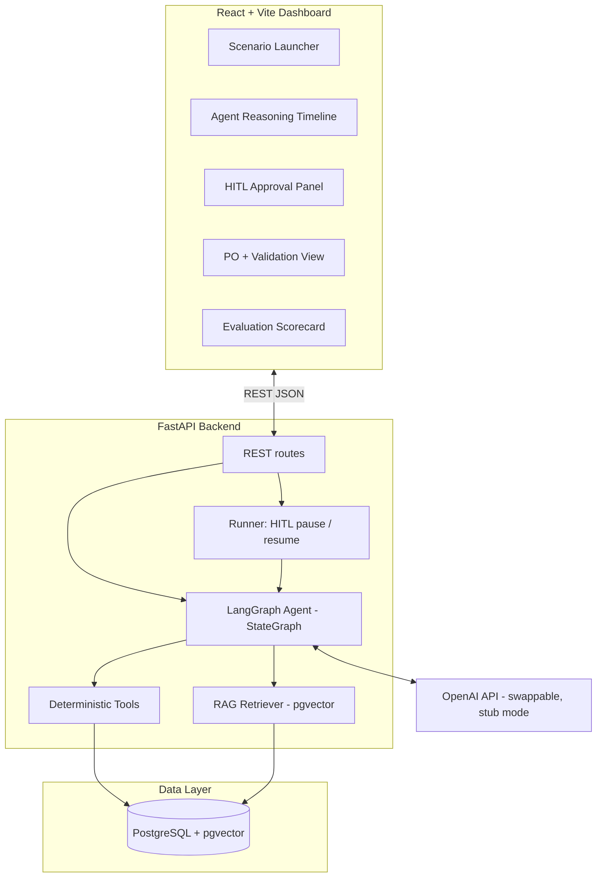
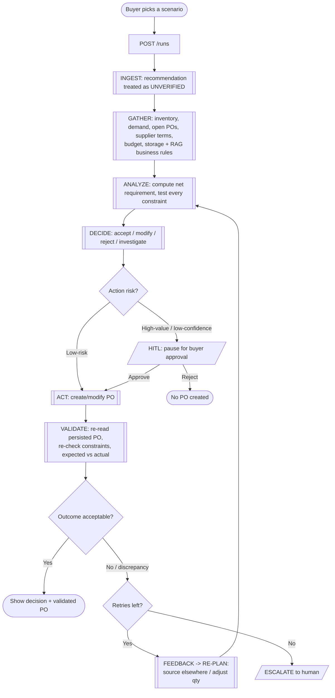

# AI Purchasing Agent

A full-stack AI agent that assists a quick-commerce buyer: it takes a purchasing
situation, **investigates** the relevant data, **decides** what to do, **acts** (creates or
modifies purchase orders), and — most importantly — **validates the outcome and re-plans
when reality differs from expectation**.

It is not a chatbot. It is a system that makes, executes, and validates purchasing
decisions, with guardrails and human-in-the-loop approval.

> Built for the Rappi "AI Buyer Agent" assignment. The stack mirrors the Rappi Fullstack
> Engineer JD: **Python + FastAPI**, **LangGraph** agent orchestration, **RAG on
> PostgreSQL + pgvector**, **Redis**-ready, **React** dashboard, **Docker Compose**.

---

## Table of contents
- [What it does](#what-it-does)
- [Architecture](#architecture)
- [User / agent flow](#user--agent-flow)
- [How decisions are made](#how-decisions-are-made)
- [The feedback loop (validation)](#the-feedback-loop-validation)
- [Guardrails & human-in-the-loop](#guardrails--human-in-the-loop)
- [Scenarios implemented](#scenarios-implemented)
- [Evaluation approach](#evaluation-approach)
- [Run it](#run-it)
- [Project structure](#project-structure)
- [Design notes & trade-offs](#design-notes--trade-offs)

---

## What it does

The agent handles two of the assignment's scenarios end-to-end:

- **Scenario 1 — Purchase Recommendation Review.** Given a recommendation to buy *N* units,
  the agent independently computes the true net requirement and decides to **accept**,
  **modify**, **reject**, or **investigate** — the recommendation is *never assumed correct*.
- **Scenario 2 — Supplier Cannot Fulfil.** An existing PO for 500 units is only confirmed
  for 250. The agent detects the shortfall *after acting*, re-plans, and sources the
  remaining 250 from an alternate supplier — or escalates if it can't.

**Core design principle: the LLM reasons and explains; deterministic tools do all the
math.** Every number the agent reports (net requirement, budget headroom, feasible
quantity) is computed by pure, unit-tested Python — never hallucinated. The system runs
fully in a deterministic **stub mode with no API key**, and transparently upgrades to real
OpenAI narration when a key is provided.

---

## Architecture



- **Deterministic tools** (`app/tools`) are pure functions over the DB and own all
  arithmetic. Unit-tested; the single source of truth.
- **RAG retriever** (`app/rag`) fetches relevant SOPs / business rules at decision time
  using pgvector's cosine operator (with an in-Python cosine fallback on SQLite).
- **LangGraph agent** (`app/agent`) orchestrates: gather → analyze → decide → act →
  validate, with a `validate → replan → analyze` loop and an interrupt for human approval.
- **Runner** (`app/agent/runner.py`) drives the graph, auto-resuming low-risk actions and
  pausing high-risk ones, and persists every run for observability.

A deeper component write-up lives in [`docs/architecture.md`](docs/architecture.md).

---

## User / agent flow



---

## How decisions are made

For **Scenario 1**, `app/agent/policy.py` reconciles the recommendation against the
computed net requirement:

```
net_requirement = demand_over_horizon + safety_stock − on_hand − incoming_open_POs
```

1. **Evidence gate** → if there's no forecast, or recent sales deviate >50% from forecast,
   the decision is **investigate** (don't commit on bad data).
2. **Already covered** → if `net_requirement ≤ 0`, **reject**.
3. **Reconcile** → accept the recommendation if it's within ±10% of net requirement;
   otherwise adjust toward net requirement.
4. **Apply hard constraints** → cap the quantity by budget, storage, and supplier capacity;
   raise to the supplier's minimum order quantity; if nothing feasible satisfies MOQ,
   **escalate**.
5. Final decision is **accept** (qty unchanged) or **modify** (qty changed).

---

## The feedback loop (validation)

This is the part the assignment cares most about, and it is a genuine closed loop:

1. **Pre-act validation** — a purchase can't violate a constraint; the policy caps the
   quantity before any write.
2. **Act** — the PO is created (committing budget + storage) or, in Scenario 2, the supplier
   is asked to confirm the existing PO.
3. **Post-act validation** (`validate` node) — the agent **re-reads persisted state**
   (not its own intent) and checks: is the PO stored with the intended quantity? Is the
   budget still within allocation? Storage within capacity? For Scenario 2: *did the
   supplier actually confirm the full quantity?*
4. **Discrepancy → replan** — in Scenario 2 the supplier confirms only 250 of 500. Validation
   computes whether inventory covers the gap; it doesn't, so it emits structured feedback
   (`gap = 250`) and loops back to `analyze`, which now evaluates an **alternate supplier**
   and sources the exact shortfall.
5. **Bounded** — the loop is capped by `MAX_AGENT_ITERS`; on exhaustion the agent
   **escalates** to a human with the full trace.

Every node writes a structured event to a `trace`, so the UI timeline and the evaluation
harness can see exactly *how* a decision (and any recovery) was reached.

---

## Guardrails & human-in-the-loop

- **Deterministic validator is authoritative** — numbers come from code, not the LLM.
- **Approval thresholds** — orders above `APPROVAL_VALUE_THRESHOLD` (default 50,000), or
  from suppliers below `MIN_SUPPLIER_RELIABILITY`, or low-confidence decisions, **pause for
  human approval** (LangGraph `interrupt_before=["act"]`). The buyer can approve, edit the
  quantity, or reject.
- **Bounded re-planning** + explicit **escalate** fallback.
- **Full trace per run** persisted for observability (the JD's "tracing agent decisions").

---

## Scenarios implemented

| Preset | SKU | Recommendation | Expected decision | Why |
|---|---|---|---|---|
| S1 · Accept | Bottled Water | 800 | **accept** 800 | Matches computed net requirement |
| S1 · Modify | Cooking Oil | 800 | **modify** → 500 | Oils budget only funds 500 units |
| S1 · Reject | Canned Beans | 800 | **reject** | Inventory + open POs already cover demand |
| S1 · Investigate | Seasonal Chocolate | 800 | **investigate** | Sales spiked ~3× vs forecast → unreliable |
| S1 · Human approval | Premium Coffee | 800 | **accept** (paused) | Order value 52,000 > 50,000 threshold |
| S2 · Supplier shortfall | Energy Drink | (PO 500) | **source_alternate** 250 | Primary confirms only 250; source the gap |

---

## Evaluation approach

Rather than a heavy framework, the harness (`app/eval`) runs each scenario and scores it
against the exact questions the assignment poses:

| Check | How it's verified |
|---|---|
| Was the decision correct? | decision type (and quantity) match the expected outcome |
| Did it obtain the necessary information? | required data-tool calls appear in the trace |
| Did it respect relevant constraints? | post-action validation passed (or no action taken) |
| Did it take the appropriate action? | a PO was created only when one should be |
| Did it validate the result? | validation checks ran on the outcome |
| Did it pause for a human when required? | HITL scenario actually reached `awaiting_approval` |
| What happens when the initial action fails? | S2 detects the shortfall, re-plans, and resolves |

Run it from the CLI (`python -m app.eval.runner`) for a printed scorecard, or from the
**Evaluation** tab in the UI. Current result: **6/6 scenarios pass**.

---

## Run it

### Option A — Docker Compose (recommended, matches the deployment target)

```bash
cp .env.example .env        # works as-is in stub mode; add OPENAI_API_KEY for real LLM
docker compose up --build
```

- Dashboard: http://localhost:5173
- API + Swagger docs: http://localhost:8000/docs

This starts PostgreSQL (with pgvector), the FastAPI backend (which auto-seeds the DB on
boot), and the React frontend.

### Option B — Local (no Docker; uses SQLite + stub LLM)

```bash
# Backend
cd backend
python3.11 -m venv .venv && source .venv/bin/activate
pip install -r requirements.txt
python -m app.db.seed                       # seed a local SQLite DB
uvicorn app.main:app --reload               # http://localhost:8000

# Frontend (separate terminal)
cd frontend
npm install
npm run dev                                 # http://localhost:5173
```

### Tests & evaluation

```bash
cd backend
python -m pytest                            # 19 unit + end-to-end tests
python -m app.eval.runner                   # evaluation scorecard (6/6)
```

### Using a real LLM

Set `OPENAI_API_KEY` in `.env`. The agent's decisions are identical either way (numbers are
deterministic); a key only enables OpenAI-generated buyer-facing narration and real
embeddings for RAG. The provider is swappable (`app/llm/provider.py`).

---

## Project structure

```
buyit/
├── backend/
│   ├── app/
│   │   ├── main.py            FastAPI app
│   │   ├── config.py          settings (env-driven)
│   │   ├── api/routes.py      REST endpoints
│   │   ├── agent/             LangGraph: state, policy, nodes, graph, runner
│   │   ├── tools/             deterministic tools: queries, constraints, actions
│   │   ├── rag/               pgvector store + SOP corpus
│   │   ├── llm/provider.py    OpenAI + deterministic stub (chat + embeddings)
│   │   ├── db/                SQLAlchemy models, session, seed
│   │   └── eval/              scenarios + scorecard runner
│   └── tests/                 pytest suite
├── frontend/                  React + Vite + Tailwind dashboard
├── docker-compose.yml
├── .env.example
└── docs/architecture.md
```

---

## Design notes & trade-offs

- **Hybrid over pure-LLM.** Keeping arithmetic and the final decision deterministic makes
  the agent reliable, testable, and auditable — the LLM can't fabricate a budget number.
  This mirrors the JD's emphasis on guardrails and preventing "incorrect or unintended
  actions."
- **Postgres + pgvector, with a SQLite fallback.** The Docker/demo path uses real pgvector
  cosine search; tests and the no-infra path fall back to in-Python cosine so everything
  runs anywhere.
- **Scope.** Two scenarios are implemented end-to-end (depth over breadth, as the
  assignment requests). Scenario 3 (demand/forecast change) is partially present as the
  "unreliable forecast → investigate" path, and Scenario 4 (constraint prevents purchase) is
  handled by the modify/escalate logic. The same architecture extends to replenishment,
  safety-stock, and alternate-supplier problems listed as optional.
- **Not implemented deliberately:** authN/Z, multi-tenant, real supplier APIs, streaming —
  out of scope for a one-day exercise.
```
