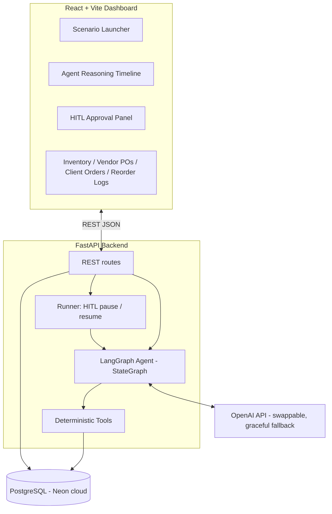
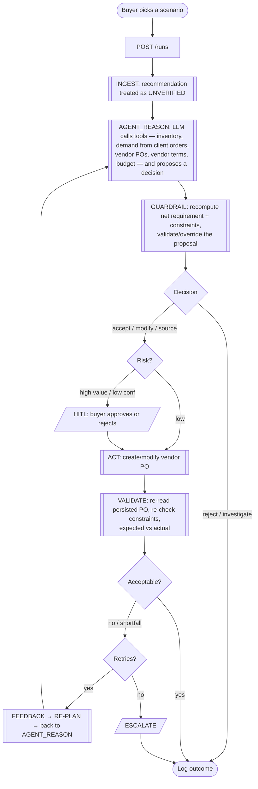

# AI Purchasing Agent — Inventory Management

A lean inventory-management application with an **AI purchasing agent** at its core. Given a
reorder situation, the agent **investigates** the data, **decides** what to do, **acts**
(creates/modifies vendor purchase orders), and **validates the outcome** — re-planning when
reality differs from expectation. Every run is stored in a reorder/agent log.

It is not a chatbot. It is a system that makes, executes, and validates purchasing
decisions, with guardrails and human-in-the-loop approval, backed by a real cloud Postgres.

> Built for the Rappi "AI Buyer Agent" assignment. Stack mirrors the Rappi Fullstack
> Engineer JD: **Python + FastAPI**, **LangGraph** agent orchestration, **PostgreSQL**
> (Neon cloud), **React** dashboard, **Docker**.

---

## What it does

Two scenarios, end-to-end:

- **Scenario 1 — Reorder Recommendation Review.** Given a recommendation to buy *N* units,
  the agent independently computes the true net requirement (from live inventory + the
  client-order demand signal) and decides to **accept / modify / reject / investigate** —
  the recommendation is *never assumed correct*.
- **Scenario 2 — Vendor Cannot Fulfil.** An existing PO for 500 units is only confirmed for
  250. The agent detects the shortfall *after acting*, re-plans, and sources the remaining
  250 from an alternate vendor — or escalates.

**Core design principle: the LLM drives; a deterministic guardrail keeps it honest.** With a
usable API key the agent genuinely reasons — it **calls tools** (function calling) to
investigate and **proposes the decision itself**. A deterministic guardrail then recomputes
the authoritative numbers and **validates the proposal, overriding it** if it violates a
constraint or contradicts the math. Every number is computed in code, never by the model.
If the key is missing/out-of-quota, it falls back to a deterministic planner, so the app and
tests always run.

---

## Data model (Postgres / Neon)

Only the tables needed to drive the flow:

| Table | Purpose |
|---|---|
| `products` | sku, name, category, unit_cost |
| `inventory` | on_hand, reserved, safety_stock, reorder_point (per SKU) |
| `client_orders` | customer orders — **the demand signal** (recent orders set the sales rate) |
| `vendors` | vendor_id, name, reliability_score |
| `vendor_products` | per-vendor terms: lead time, MOQ, unit price, capacity, is_primary |
| `vendor_purchase_orders` | qty, confirmed_qty, status (open/partial/confirmed/…) |
| `budgets` | allocated, spent (per category) |
| `reorder_logs` | **every agent run**: the recommendation reviewed + the agent's full working (trace) |

Demand is derived from the client-order stream: the last 7 days set the sales rate (projected
over a 30-day horizon); a >50% jump vs the previous 7 days flags a **demand anomaly** →
the agent chooses *investigate*.

---

## Architecture



- **`agent_reason`** — the LLM investigates via tool calls and proposes a decision.
- **`guardrail`** — deterministic recompute + validate/override (catches hallucinations).
- **Tools** (`app/tools`) — pure functions over the DB; own all arithmetic; unit-tested.
- **Runner** (`app/agent/runner.py`) — drives the graph, auto-resumes low-risk actions,
  pauses high-risk ones, and writes every run to `reorder_logs`.

Deeper write-up: [`docs/architecture.md`](docs/architecture.md).

---

## Agent / user flow



---

## Decision logic

```
net_requirement = demand_over_horizon + safety_stock − on_hand − incoming_open_POs
```

1. **Evidence gate** → demand anomaly (>50% week-over-week) or missing data → **investigate**.
2. **Already covered** → `net_requirement ≤ 0` → **reject**.
3. **Reconcile** → accept the recommendation if within ±10% of net requirement; else adjust.
4. **Constraints** → cap by budget and vendor capacity; raise to vendor MOQ; if nothing
   feasible satisfies MOQ → **escalate**.
5. Final: **accept** (qty unchanged) or **modify** (qty changed).

The **guardrail** derives this deterministically and compares it to the LLM's proposal; if
they differ it overrides and records that it did — so a wrong LLM call never executes.

## Feedback loop (Scenario 2)

The agent first acts on the existing PO (expecting 500). `simulate_vendor_response` confirms
only 250. `validate` re-reads the result, sees the shortfall, checks whether inventory covers
it (it doesn't), and emits structured feedback (`gap = 250`). `replan` loops back to
`agent_reason`, which now sources exactly 250 from the alternate vendor; `validate` passes.
Bounded by `MAX_AGENT_ITERS`, then escalates.

---

## Scenarios

| Preset | SKU | Recommendation | Expected | Why |
|---|---|---|---|---|
| S1 · Accept | Bottled Water | 800 | **accept** 800 | Matches computed net requirement |
| S1 · Modify | Cooking Oil | 800 | **modify** → 500 | Oils budget only funds 500 |
| S1 · Reject | Canned Beans | 800 | **reject** | Inventory + open POs already cover demand |
| S1 · Investigate | Seasonal Chocolate | 800 | **investigate** | Client orders spiked ~3× vs prior week |
| S1 · Human approval | Premium Coffee | 800 | **accept** (paused) | Order value 52,000 > 50,000 threshold |
| S2 · Vendor shortfall | Energy Drink | (PO 500) | **source_alternate** 250 | Vendor confirms only 250; source the gap |

---

## Evaluation

`app/eval` runs each scenario and scores it against the assignment's six questions (decision
correct? obtained the info? respected constraints? right action? validated? recovered on
failure?). Run `python -m app.eval.runner` (or the API `POST /eval/run`). Current: **6/6**.
Plus **21 unit/e2e tests** (`pytest`).

---

## Run it

The database is **Neon (cloud Postgres)** — no local DB to run.

### Docker

```bash
cp .env.example .env      # set DATABASE_URL (Neon) and optionally OPENAI_API_KEY
docker compose up --build
```
- Dashboard: http://localhost:5173
- API + Swagger: http://localhost:8000/docs

The API seeds the database on startup (drop & recreate the app's tables).

### Local

```bash
# Backend
cd backend
python3.11 -m venv .venv && source .venv/bin/activate
pip install -r requirements.txt
python -m app.db.seed          # seed Neon
uvicorn app.main:app --reload  # http://localhost:8000

# Frontend
cd frontend && npm install && npm run dev   # http://localhost:5173
```

### Tests

```bash
cd backend && python -m pytest          # uses a local SQLite DB (no Neon needed)
```

### LLM

Set `OPENAI_API_KEY` in `.env`. On startup the app probes the key; if it's missing, invalid,
or out of quota, it falls back to a deterministic planner (same decisions). `GET /health`
reports the provider actually in use (`openai` vs `stub`).

---

## Project structure

```
backend/app/
  main.py            FastAPI app
  api/routes.py      REST endpoints (runs, inventory, vendors, POs, client orders, logs, eval, reset)
  agent/             LangGraph: state, policy, tools_schema, nodes, graph, runner, prompts
  tools/             deterministic tools: queries, constraints, actions
  llm/provider.py    OpenAI + deterministic stub (chat + probe)
  db/                models, session, seed
  eval/              scenarios + scorecard runner
frontend/            React + Vite + Tailwind dashboard
```

---

## Notes & trade-offs

- **LLM-driven with a deterministic guardrail** — agentic flexibility *and* reliability; the
  override is surfaced in the trace (doubles as hallucination detection).
- **Demand from client orders** — realistic for an inventory app; the same signal makes
  Scenario 3 (demand change) a natural extension.
- **Lean by design** — only the tables/constraints needed for Scenarios 1 & 2. No RAG,
  storage, or multi-node modelling (kept out to avoid over-engineering).
- Secrets live only in `.env` (gitignored); never commit the Neon password or API key.
```
