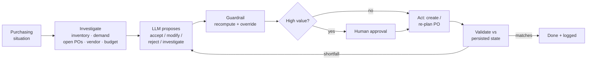
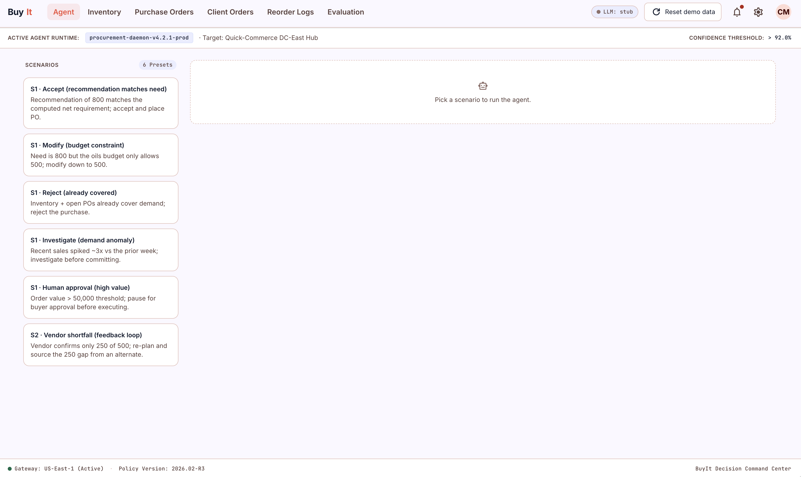

# BuyIt — AI Purchasing Agent

A full-stack AI purchasing agent for a quick-commerce buyer: it **investigates** the data,
**decides**, **acts** (creates / re-plans vendor POs), and **validates the outcome** —
re-planning when reality differs from the plan.

| | |
|---|---|
| **GitHub** | https://github.com/D18hr-uv/buyit |
| **Live demo** | https://frontend-five-taupe-85.vercel.app/ |
| **API health** | https://buyit-4lvi.onrender.com/health |

> ### 🔑 LLM is optional — OpenAI *or* Stub mode
> - **`OPENAI_API_KEY` set →** real LLM reasoning via **OpenAI** (tool-calling).
> - **key blank →** deterministic **stub mode** — the app is fully functional and makes the
>   **same decisions**, just reproducibly and for free.
>
> A deterministic **guardrail** makes the final decision correct **either way**, so the LLM
> is a reasoning layer, not a dependency. *The live demo runs in stub mode.*
> *(Render free tier sleeps when idle — the first request may take ~30–50s to wake.)*

## How it works

**In short:** the LLM proposes a decision from real tool data; a deterministic guardrail
recomputes the true net requirement / budget / MOQ and **overrides** anything wrong (shown
in the trace = hallucination detection); high-value orders pause for **human approval**;
after acting, the system re-reads the *actually persisted* state and **re-plans** on a
mismatch (e.g. vendor confirms 250 of 500 → source the gap elsewhere).

## Scenarios (end-to-end)

- **S1 — Recommendation review:** accept · modify (budget cap) · reject (already covered) ·
  investigate (demand anomaly) · human-approval (high value).
- **S2 — Supplier shortfall:** confirm < ordered → re-plan → alternate vendor.

Runs are also launchable from data rows (low-stock SKU → *Review reorder*, open PO →
*Re-plan*) in an in-context drawer.

## Evaluation

`POST /eval` + the **Evaluation** tab score every scenario against the brief's checks —
decision correct, obtained info, respected constraints, right action, validated, recovered
on failure. Backed by **37 automated tests**.

## Tech

Python · **FastAPI** · **LangGraph** · **PostgreSQL / Neon** · **React + Vite + Tailwind** ·
Docker. Deployed on **Render** (API) + **Vercel** (UI). Full setup + architecture diagram
in the repo `README.md`.

## Live screenshots

  

  

