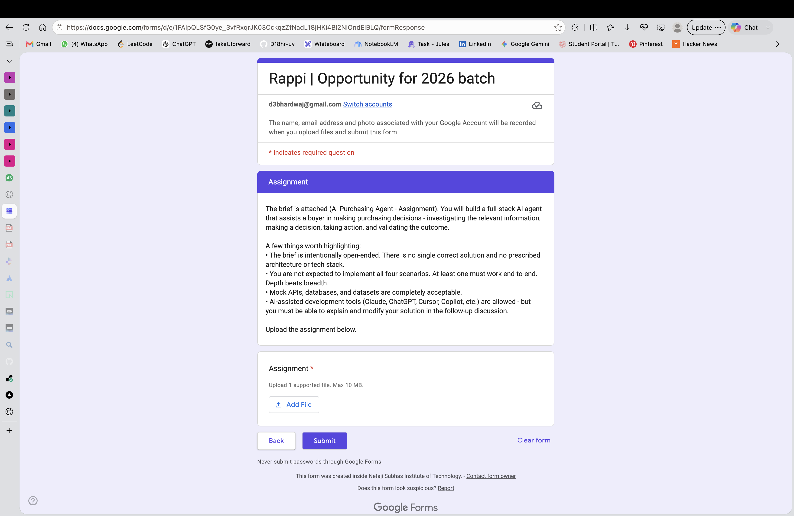

# BuyIt — AI Purchasing Agent

A full-stack AI purchasing agent for a quick-commerce buyer. Given a purchasing
situation, it **investigates** the real data, **decides** (accept / modify / reject /
investigate / escalate), **acts** (creates or re-plans vendor POs), and **validates the
outcome** against persisted state — re-planning when reality differs from expectation.

| | |
|---|---|
| **GitHub** | https://github.com/D18hr-uv/buyit |
| **Live demo** | https://frontend-five-taupe-85.vercel.app/ |
| **API health** | https://buyit-4lvi.onrender.com/health |

> The live app runs in deterministic **stub mode** (no API key needed), so every run is
> reproducible. Setting `OPENAI_API_KEY` switches on real LLM reasoning.
> *Render free tier sleeps when idle — the first request may take ~30–50s to wake.*

## Approach

The agent is **LLM-driven with a deterministic guardrail**. An LLM plans via tool-calls
(query inventory, demand, open POs, vendor terms, budget), but its proposal is never
trusted blindly: a deterministic guardrail recomputes the true net requirement, budget
headroom, MOQ and capacity, and **overrides** a wrong/hallucinated quantity — the override
is shown in the reasoning trace, so it doubles as hallucination detection. High-value
orders pause at a **human-in-the-loop** approval gate.

**The feedback loop (what we validate):** after the agent acts, the system re-reads the
*actually persisted* PO/inventory state (not the agent's intent) and checks it against the
plan. If the outcome differs — e.g. a vendor confirms only 250 of 500 units — the agent
re-plans and sources the gap from an alternate supplier (Scenario 2). Committing a PO also
commits category budget, so over-commitment is caught by real state, not assumptions.

## Scenarios implemented (end-to-end)

- **S1 — Purchase Recommendation Review:** all four branches — **accept**, **modify**
  (budget cap), **reject** (already covered), **investigate** (demand anomaly), plus a
  **human-approval** high-value path.
- **S2 — Supplier shortfall:** vendor confirms less than ordered → re-plan → source the
  remainder from an alternate vendor.

Scenarios are also launchable **contextually** from data rows (e.g. a low-stock SKU →
"Review reorder", an open PO → "Re-plan"), with the run shown in an in-context drawer.

## Evaluation

A deterministic scorecard (`POST /eval`, and the **Evaluation** tab) runs the scenario
suite and scores each against the brief's criteria: *was the decision correct, did it
obtain the info, respect constraints, take the right action, validate the result, and
recover on failure.* Backed by **37 automated tests** (tools, guardrail overrides, agent
branches, the S2 loop, and the REST endpoints).

## Tech stack

Python · **FastAPI** · **LangGraph** (agent orchestration) · **PostgreSQL / Neon** ·
**React + Vite + Tailwind** · Docker. Deployed on **Render** (API) + **Vercel** (UI).
Full setup/run steps and the architecture diagram are in the repo `README.md`.

## Live screenshots

  
  

  

